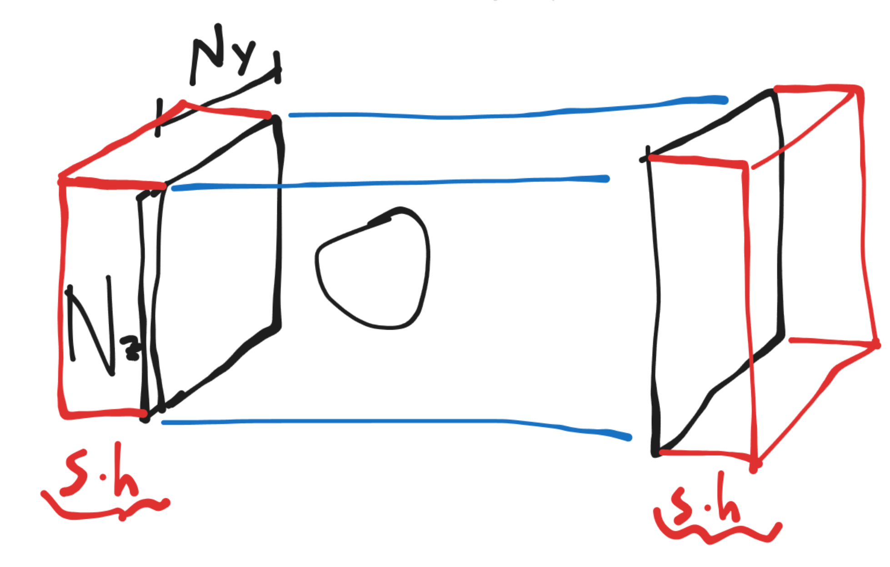

# INFLOW & OUTFLOW CREATION

To create inflow outflow one have to carry out the following steps:

1)   
   Define sufficient particles in a buffer to be feed in the inflow in the [Create.py](http://Create.py) script. Note imove=-255, location slightly out of the calculation domain. 

   
   
   The buffer thickness is just the maximum amount of particles you expect to be living on the inflow area (so the maximum number of particles you need to get from the buffer and add at the inflow). The red volumes are the particles controlled by the inflow and the outflow. n_buffer_depth is just a just in case extra buffer.

   Setup the Inlet buffer particles. In this case we need to continuously feed  with particles at a rate of Ny * Nz articles each dr / u seconds, during  the full simulation. That is because we have no outlet, so the buffer will be refilled during the runtime

   ddom = 2 * 2.0 * h

   domain_min = (-hL - ddom, -hB - ddom, -hh - ddom, 0.0)
   
   domain_max = (hL + ddom, hB + ddom, hh + ddom, 0.0)

   n\_buffer\_depth \= 16
      
   n\_buffer \= Ny \* Nz \* (n\_buffer\_depth \+ int(math.ceil(u \/ dr * t\_max)))


   x \= domain_max[0] \+ 2.0 \* h
   
   y \= domain_max[1] \+ 2.0 \* h
   
   z \= domain_max[2] \+ 2.0 \* h   

   
   for i in range(n\_buffer):

       n \+= 1
       
       imove \= \-255
       
       mass \= rho2 \* dr\*\*2.0
       
       string \= ("{} {} {} 0.0, " \* 5 \+ "{}, {}, {}, {}, {}, {}\\n").format(

       	      x, y, z,

	      0.0, 0.0, 0.0,

	      0.0, 0.0, 0.0,

	      0.0, 0.0, 0.0,

	      0.0, 0.0, 0.0,

	      rho2,

	      0.0, 

	      e2,

	      0.0,

	      mass,

	      imove)
	      
   output.write(string)

   n\_fluid \+= 1

b)  
Add

```xml
   \<Include file="resources/Presets/cfd/inlet.xml" /\>
   
   \<Include file="resources/Presets/cfd/outlet.xml" /\>
```
to Main.xml

c)
In inflow.xml the variables that should be defined are listed and described. Those are:

   inflow_r = Lower corner of the inflow square
   
   inflow_ru = Square U vector. 
   
   inflow_rv = Square V vector
   
   inflow_N = Number of particles to be generated in each direction
   
   inflow_n = Velocity direction of the particles
   
   inflow_U = Constant inflow velocity magnitude
   
   inflow_rFS = The point where the pressure is the reference one (0 Pa).

Note that the format of the input assumes that UV coordinates are utilized. Those require a point and two vectors (analogous to tangent plane).

It is therefore necessary to add these variables to an xml file. It is customary to define them in SPH.xml file:

```xml

       \<\!-- Inlet boundary condition \--\>  

       \<Variable name="inflow\_r" type="vec"
       value="-0.5\*{{L}}, \-0.5\*{{B}}, \-0.5\*{{H}}, 0.0" /\>  

       \<Variable name="inflow\_ru" type="vec"
       value="0.0, {{B}}, 0.0, 0.0" /\>  

       \<Variable name="inflow\_rv" type="vec"
       value="0.0, 0.0, {{H}}, 0.0" /\>
       
       \<Variable name="inflow\_rFS" type="vec"
       value="-0.5\*{{L}}, 0.0, 0.0, 0.0" /\>  

       \<Variable name="inflow\_N" type="uivec2"
       value="{{NY}}, {{NZ}}" /\>  

       \<Variable name="inflow\_n" type="vec"
       value="1.0, 0.0, 0.0, 0.0" /\>  

       \<Variable name="inflow\_U" type="float"
       value="{{U2}}" /\>  

       \<Variable name="inflow\_rho" type="float"
       value="{{RHO2}}" /\>  

       \<Variable name="inflow\_e" type="float"
       value="{{E2}}" /\>
```

d)  
Pass the previous variables from Create.py modifiying the script to give the adequate values.

